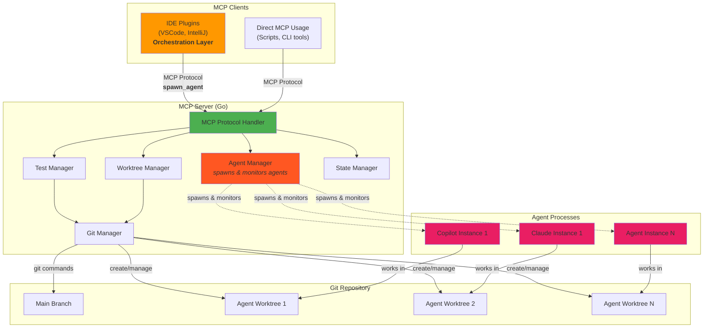
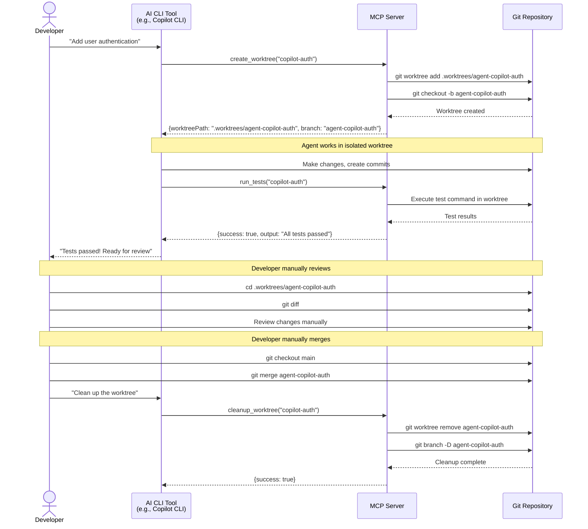
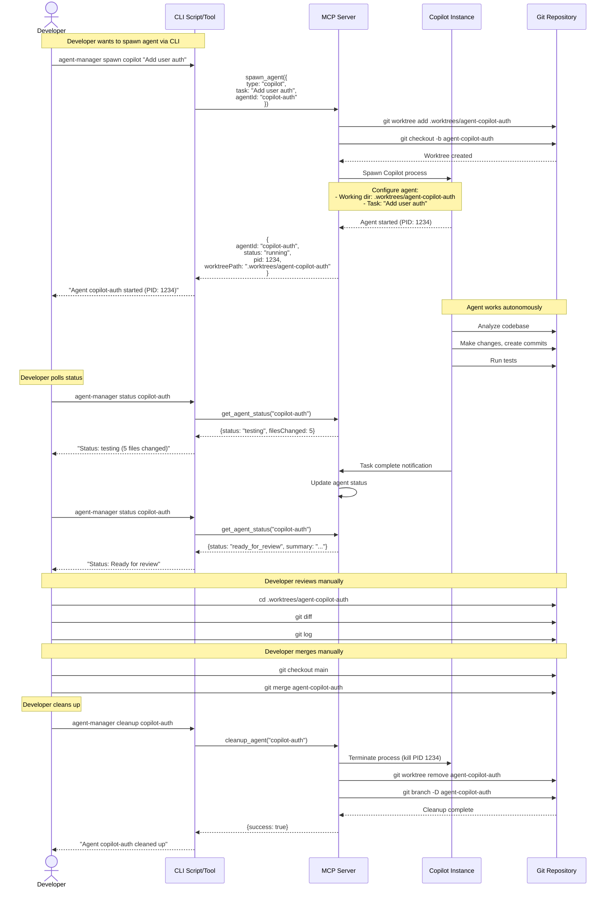
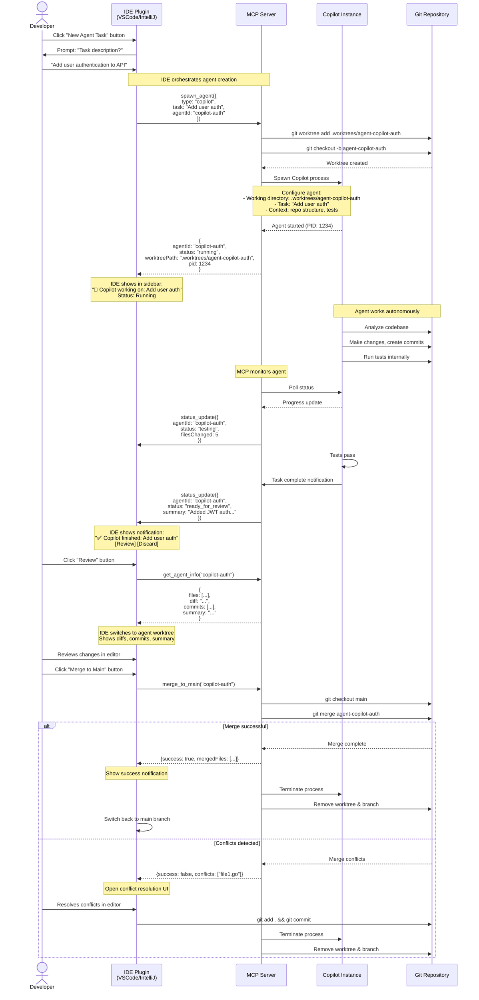

# Architecture

This document visualizes the architecture and workflows for the Agent Manager MCP server.

## System Architecture



## CLI Workflow - Basic (MVP)



## CLI Workflow - Orchestration (Future)



## IDE Plugin Workflow (Future Vision - Orchestration Mode)



## Key Design Principles

1. **Orchestration-First**: MCP server manages both worktrees AND agent processes, providing full lifecycle management
2. **Protocol-First**: All functionality exposed via MCP tools, usable by any MCP client
3. **Client-Agnostic**: Server written in Go works with TypeScript (VSCode), Java/Kotlin (IntelliJ), and CLI tools
4. **Human-in-the-Loop**: Critical operations (merge, agent spawning) designed to be triggered by human approval via IDE
5. **Progressive Enhancement**:
   - MVP: Basic worktree + git info (manual agent usage)
   - Future: Full agent spawning + monitoring + IDE integration
6. **Process Isolation**: Each agent gets dedicated worktree + process, preventing interference
7. **Single Source of Truth**: One MCP server binary, multiple client implementations

---

## Clean Architecture

### Layer Organization

The implementation follows Clean Architecture principles with strict dependency rules: dependencies always point **inward** toward the domain.

```
┌─────────────────────────────────────────────────────────┐
│  Interface Adapters (Outside)                           │
│  - MCP Protocol Handlers (tools/resources)              │
│  - CLI Command Handlers (future)                        │
│  - Configuration Parsers (YAML/JSON → Domain)           │
│  - DTOs (MCP Request/Response types)                    │
└─────────────────────────────────────────────────────────┘
                         │
                         ▼
┌─────────────────────────────────────────────────────────┐
│  Application Layer (Use Cases)                           │
│  - CreateWorktree                                        │
│  - RunTests                                              │
│  - MergeToMain                                           │
│  - SpawnAgent (future)                                   │
│  - CleanupWorktree                                       │
│  - GetAgentInfo                                          │
└─────────────────────────────────────────────────────────┘
                         │
                         ▼
┌─────────────────────────────────────────────────────────┐
│  Domain Layer (Business Logic)                           │
│  Entities:                                               │
│    - Agent (aggregate root)                              │
│    - Worktree                                            │
│    - Repository                                          │
│  Value Objects:                                          │
│    - AgentID, WorktreePath, BranchName                   │
│  Domain Services:                                        │
│    - AgentLifecycleService                               │
│    - MergeConflictResolver                               │
│  Domain Events:                                          │
│    - AgentCreated, WorktreeCreated, TestsCompleted       │
│    - MergeSucceeded, MergeFailed                         │
└─────────────────────────────────────────────────────────┘
                         │
                         ▼
┌─────────────────────────────────────────────────────────┐
│  Infrastructure Layer (Outside)                          │
│  - GitClient (worktree, commit, merge, diff operations)  │
│  - ProcessManager (spawn/kill agent processes)           │
│  - FileSystem (path operations, file I/O)                │
│  - InMemoryAgentRepository (MVP)                         │
│  - SQLiteAgentRepository (future)                        │
│  - MCPTransport (stdio/HTTP)                             │
└─────────────────────────────────────────────────────────┘
```

### Dependency Rules

**CRITICAL**: Dependencies flow **inward only**:
1. **Interface Adapters** depend on **Application**
2. **Application** depends on **Domain**
3. **Infrastructure** implements interfaces defined in **Domain** and **Application**
4. **Domain** has **ZERO** dependencies on outer layers

### Directory Structure

```
agent-manager-mcp/
├── cmd/
│   ├── server/
│   │   └── main.go                    # MCP server entrypoint
│   └── cli/
│       └── main.go                    # CLI tool entrypoint (future)
│
├── internal/
│   ├── domain/                        # DOMAIN LAYER (zero external dependencies)
│   │   ├── agent.go                   # Agent aggregate root
│   │   ├── agent_test.go
│   │   ├── worktree.go                # Worktree entity
│   │   ├── worktree_test.go
│   │   ├── repository.go              # Repository entity
│   │   ├── value_objects.go           # AgentID, WorktreePath, BranchName
│   │   ├── value_objects_test.go
│   │   ├── domain_events.go           # AgentCreated, TestsFailed, etc.
│   │   ├── errors.go                  # Domain-specific errors
│   │   └── ports.go                   # Interfaces (AgentRepository, GitOperations)
│   │
│   ├── application/                   # APPLICATION LAYER (use cases)
│   │   ├── create_worktree.go         # CreateWorktreeUseCase
│   │   ├── create_worktree_test.go
│   │   ├── run_tests.go               # RunTestsUseCase
│   │   ├── run_tests_test.go
│   │   ├── merge_to_main.go           # MergeToMainUseCase
│   │   ├── merge_to_main_test.go
│   │   ├── get_agent_info.go          # GetAgentInfoUseCase
│   │   ├── cleanup_worktree.go        # CleanupWorktreeUseCase
│   │   ├── errors.go                  # Application errors (NotFound, Conflict, etc.)
│   │   ├── config.go                  # Application configuration struct
│   │   └── ports.go                   # App-level interfaces (TestRunner, EventBus)
│   │
│   ├── infrastructure/                # INFRASTRUCTURE LAYER
│   │   ├── git/
│   │   │   ├── git_client.go          # GitClient implements domain.GitOperations
│   │   │   ├── git_client_test.go     # Integration tests
│   │   │   └── errors.go              # Git-specific errors
│   │   ├── process/
│   │   │   ├── process_manager.go     # For spawning agent processes (future)
│   │   │   └── process_manager_test.go
│   │   ├── persistence/
│   │   │   ├── in_memory_repository.go    # InMemoryAgentRepository
│   │   │   ├── sqlite_repository.go       # SQLiteAgentRepository (future)
│   │   │   └── repository_test.go
│   │   ├── shell/
│   │   │   ├── command_runner.go      # Implements TestRunner interface
│   │   │   └── command_runner_test.go
│   │   └── config/
│   │       ├── loader.go              # Load YAML/JSON config
│   │       └── loader_test.go
│   │
│   └── adapters/                      # INTERFACE ADAPTERS LAYER
│       ├── mcp/
│       │   ├── server.go              # MCP server setup
│       │   ├── transport.go           # Stdio/HTTP transport
│       │   ├── tools/
│       │   │   ├── create_worktree.go # MCP tool handler
│       │   │   ├── run_tests.go
│       │   │   ├── merge_to_main.go
│       │   │   ├── get_agent_info.go
│       │   │   └── cleanup_worktree.go
│       │   ├── resources/             # MCP resources (future)
│       │   │   └── agent_resource.go
│       │   ├── dto.go                 # MCP request/response DTOs
│       │   └── error_mapper.go        # Map app errors to MCP errors
│       └── cli/                       # CLI adapters (future)
│           └── commands/
│               └── spawn.go
│
├── pkg/                               # Public packages (if any)
│
├── test/                              # Integration/E2E tests
│   ├── integration/
│   │   └── worktree_flow_test.go
│   └── e2e/
│       └── mcp_server_test.go
│
├── config/
│   └── config.example.yaml            # Example configuration
│
├── docs/
│   ├── concept.md
│   ├── architecture.md
│   └── plans/
│
├── go.mod
├── go.sum
├── Makefile
└── README.md
```

### Key Architectural Decisions

1. **Agent as Aggregate Root**: Agent owns Worktree lifecycle, enforces business rules, emits domain events
2. **Repository Pattern for Persistence**: Abstracts storage, allows in-memory MVP and future SQLite without domain changes
3. **Git Operations as Port**: Domain doesn't depend on git implementation, enables testing without actual git
4. **Use Cases as Public API**: MCP tools, CLI commands, future REST API all use same use cases
5. **Value Objects for Type Safety**: AgentID, WorktreePath, BranchName enforce invariants, prevent primitive obsession
6. **Domain Events for Decoupling**: Agent lifecycle changes emit events for logging, monitoring, future webhooks

### Implementation Priorities

#### Phase 1: Domain Layer
**Priority: HIGHEST** - Establishes business rules with zero dependencies

1. Define value objects (AgentID, WorktreePath, BranchName)
2. Create Agent aggregate root with business methods
3. Create Worktree and Repository entities
4. Define domain interfaces (ports)
5. Write comprehensive domain tests

**Deliverable**: Domain package with high test coverage, zero external dependencies

#### Phase 2: Infrastructure Layer
**Priority: HIGH** - Implements technical concerns

1. GitClient adapter implementing GitOperations
2. InMemoryAgentRepository implementing AgentRepository
3. CommandRunner for test execution
4. Configuration loader
5. Integration tests for infrastructure components

**Deliverable**: Working infrastructure adapters with integration tests

#### Phase 3: Application Layer
**Priority: HIGH** - Orchestrates domain logic

1. CreateWorktreeUseCase
2. RunTestsUseCase
3. GetAgentInfoUseCase
4. CleanupWorktreeUseCase
5. MergeToMainUseCase
6. Unit tests with mocked dependencies

**Deliverable**: Use cases with dependency injection, fully tested

#### Phase 4: Interface Adapters
**Priority: MEDIUM** - Exposes functionality via MCP

1. MCP server setup and transport
2. Tool handlers (create_worktree, run_tests, get_agent_info)
3. DTO mappings
4. Error mapping to MCP error codes
5. Integration tests via MCP protocol

**Deliverable**: Working MCP server binary

#### Phase 5: Integration & Polish
**Priority: MEDIUM**

1. End-to-end tests
2. Configuration examples
3. Documentation
4. Build/release pipeline

### Critical Success Factors

1. **Clear layer boundaries** enforced from day one
2. **Dependency direction** always inward (toward domain)
3. **Testability** as primary design driver
4. **Interface-based** contracts between layers
5. **No infrastructure** in domain or application layers
6. **Event-driven** over polling/timeouts
7. **Explicit error handling** with full context
